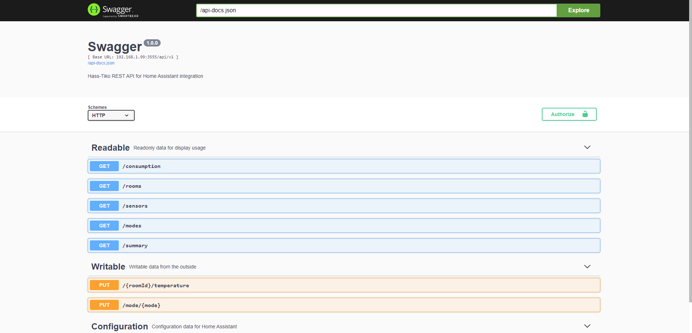
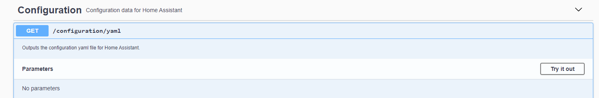
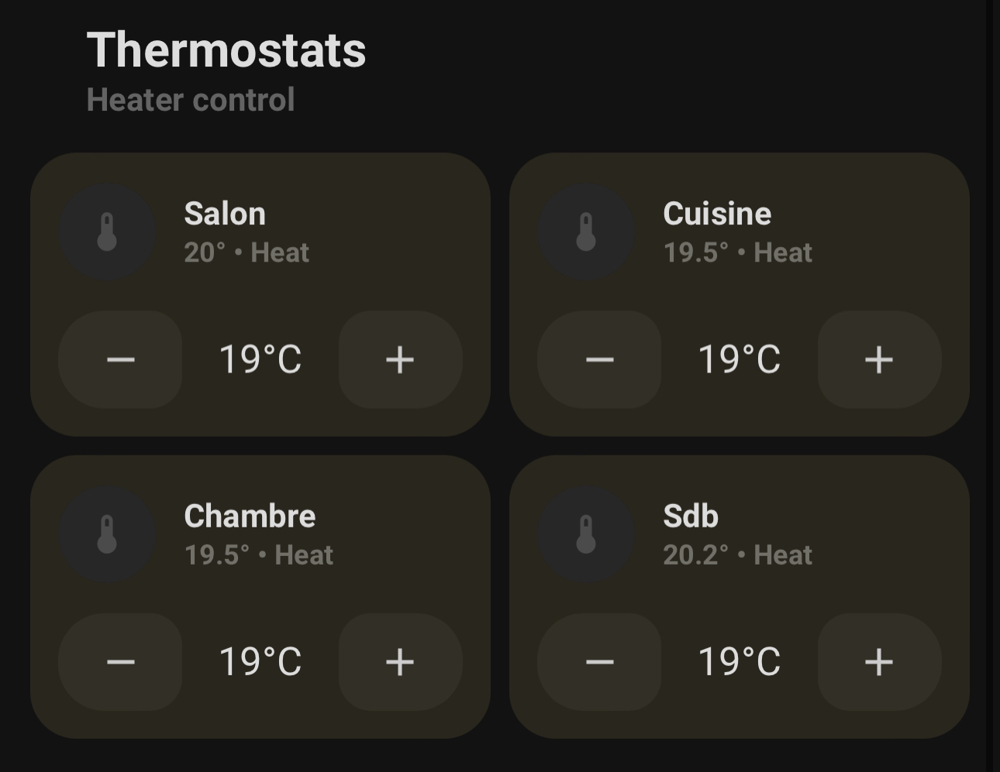

# Tiko integration for Home Assistant
> This project is heavily based on [noiwid's tiko_heating_api](https://github.com/noiwid/tiko_heating_api), he did an amazing job with it and I merely expanded on what he created. Go give him a star, he deserves it!  
  
The hass-tiko project objective is to provide a RESTful API that allows you to access your [Tiko](https://tiko.fr/) smart heating data from anywhere. It was built with Home Assistant in mind, providing an auto-generated YAML configuration to add the necessary sensors to your IOT environment.  
  
Please bear in mind that this is a very early version that probably contains a lot of bugs. It works just fine for me, but if for whatever reason you encounter any kind of issue, please let me know on GitHub, and I'll try my best to fix your potential bugs.  

## Installation
There are two ways to use the hass-tiko project. You can either build the Docker image with the provided Dockerfile (Maybe I'll provide a pre-built image on Docker Hub soon), or you can directly run it with NodeJS. For the sake of simplicity, I advise using Docker, which is prefered by a lot of self-hosters nowadays.

### NodeJS install
In order to ruin the project with NodeJS, start by cloning the project. Once that's done, head in the project folder and execute the following command:  
```
npm install
```
You can then start hass-tiko by executing this command, which will start the server:
```
npm run dev
```
It will crash however, as you need to pass some environment variables beforehand:  
- **SERVICE_URL**: The URL from which this service is accessible. Should be `http://localhost`.
- **SERVICE_PORT**: The port from which this service is accessible. You can set it to anything, I use `3001`.
- **SERVER**: The Tiko server requests should be made to. This is already set to `https://portal-engie.tiko.ch` by default, but you might want to change that to `https://particuliers-tiko.fr/` depending on your installation.
- **EMAIL**: The email address linked to your Tiko account.
- **PASSWORD**: The password to your Tiko account.  
  
You can then start the server once again, and everything should run (provided that all the provided variables are correct) and let you access your data. See below to access the Swagger UI.

### Docker install
Just like for NodeJS, start by cloning the project and navigating inside.  
It ships with a Dockerfile that you can use to build the image. You can build it with the following command:
```
docker build -t hass-tiko .
```
Once the build is finished, you can run the following command to start the server:  
```
docker run -p 3001:3001 -e EMAIL=your@email.com -e PASSWORD=YOURPASSWORD hass-tiko
```
Note that unlike for the NodeJS installation, you only have to pass the `EMAIL` and `PASSWORD` environment variables. You can override the other variables if you need to, but they are set by default in the Dockerfile.

## Swagger UI
In order to test your installation and see which endpoints are available, the project ships with a Swagger UI that is accessible at the url ``http://yourserviceurl:yourport/api-docs``:
  
  
  
You can test the endpoints by clicking on them.

## Generating the YAML configuration
This tool comes with a YAML configuration generator. It creates all the necessary sensors, automations and climate objects needed for Home Assistant to interact with the API and allows you to control your heating system from your Home Assistant dashboard, or even your vocal assistants!  
You can access the YAML configuration in the Swagger UI (see above). 


  
Click on the endpoint `/configuration/yaml`, then click on the `Try it out` button. You can then press the `Execute` button to see your YAML configuration file in the output box.  
> I am working on improving this system in order to display a WebUI that lets you configure everything without environment variables and using the Swagger UI. In the meantime, this works just fine though :)  
  
### Importing the configuration
In order to import the Tiko integration in your Home Assistant installation, there's only four steps:
- If it isn't there already, add the following line to your `config/configuration.yaml` file:
```
packages: !include_dir_merge_named packages/
```
- Create a `packages` folder in your `/config` folder.
- Paste the previously generated YAML content in `/config/packages/tiko.yaml` (create `tiko.yaml` yourself!).
- Restart your Home Assistant installation for all the changes to take effect.

### Using the new data in Home Assistant
There are many, many ways you can use all the new data generated in the YAML configuration within your Home Assistant instance. There will probably be a dashboard card generator in the future, but in the meantime, I recommend the wonderful [UI Lovelace Minimalist](https://github.com/UI-Lovelace-Minimalist/UI) 'theme', which I configured like this for my installation:  



## Future improvements
There's quite a lot I want to change within this project. It was made over a few hours of free time and is quite frankly not satisfactory in its current state. Things to do:  
- [ ] Improve the setup documentation
- [ ] Move the YAML generation code to a dedicated service
- [ ] Strongly type everything
- [ ] Properly deal with errors (return error messages, etc)
- [ ] Properly log with Winston
- [ ] Add a setup UI to guide through Home Assistant setup
- [ ] Add a dashboard to easily access YAML configuration and generate dashboard cards
- [ ] Add a dashboard to see Tiko data on the fly
