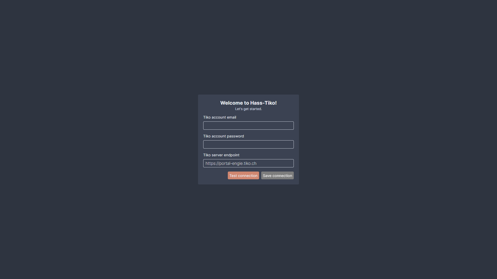
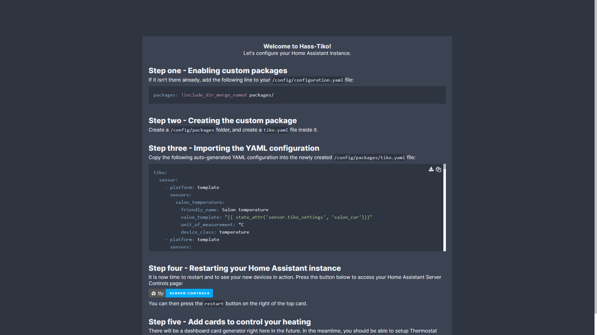

# Tiko integration for Home Assistant
> This project is heavily based on [noiwid's tiko_heating_api](https://github.com/noiwid/tiko_heating_api), he did an amazing job with it and I merely expanded on what he created. Go give him a star, he deserves it!  
  
The hass-tiko project objective is to provide a RESTful API that allows you to access your [Tiko](https://tiko.fr/) smart heating data from anywhere. It was built with Home Assistant in mind, providing an auto-generated YAML configuration to add the necessary sensors to your IOT environment and a step-by-step web-guide to help you set everything up.
  
Please bear in mind that this is a very early version that probably contains a lot of bugs. It works just fine for me, but if for whatever reason you encounter any kind of issue, please let me know on GitHub, and I'll try my best to fix your potential bugs.  

## Installation
There are two ways to use the hass-tiko project. You can either build the Docker image with the provided Dockerfile (Maybe I'll provide a pre-built image on Docker Hub soon), or you can directly run it with NodeJS. For the sake of simplicity, I advise using Docker, which is preferred by a lot of self-hosters nowadays.

### NodeJS install
In order to ruin the project with NodeJS, start by cloning the project. Once that's done, head in the project folder and execute the following command:  
```
npm install
```
You can then start hass-tiko by executing this command, which will start the server:
```
npm run dev
```
See how to configure the app from here in the [Configuring the connection](#configuring-the-connection) section.

### Docker install
Just like for NodeJS, start by cloning the project and navigating inside it.  
It ships with a Dockerfile that you can use to build the image. You can build it with the following command:
```
docker build -t hass-tiko .
```
Once the build is finished, you can run the following command to start the server:  
```
docker run -p 3001:3001 -v /your/local/config/folder:/usr/src/app/config/ hass-tiko
```
> The `-v` mount is important if you want to make your connection configuration persist!
  
See how to configure the app from here in the [Configuring the connection](#configuring-the-connection) section.

## Configuring the connection
If you check the logs after a first run, you'll notice that the following message is displayed:
```
info: Configuration not found. Please head to the /configuration endpoint to set everything up! {"service":"server"}
```
Whereas the previous versions of this tool required you to manually pass the correct environment variables, this version ships with a configuration UI that lets you set everything up easily.  
You can access it at http://yourdomain:3001/configuration (of course, replace http://yourdomain with wherever your instance of the project is).  
> The application launches on port 3001 by default, but you can override that in the `tiko.env` file that is created in the project root after a first configuration, or by manually passing the `SERVICE_PORT` environment variable.

If for whatever reason you wish to provide the environment variables yourself, please refer to the [Environment variables](#environment-variables) section.  
  
You should arrive at a page that looks like this:  



Just fill in your Tiko email, password and endpoint (which is set by default to `https://portal-engie.tiko.ch`, but could also be `https://particuliers-tiko.fr`). Then, click `Test connection` to ensure everything is working. If it's all in order, the `Save connection` button will be enabled, and you'll be able to carry on to the next page:  



This is pretty straightforward and probably doesn't require an explanation: just follow the steps, and you should be ready to use this project in no time.

## Environment variables
Although all the environment variables of the project are automatically created when you go through the WebUI setup, you can also choose to provide them manually. Here are the currently usable variables:  

| Variable name    | Description                                                                                             | Default value |
| ---------------- | ------------------------------------------------------------------------------------------------------- | ------------- |
| ENDPOINT         | Endpoint for the Tiko API that the tool will query.                                                     | undefined     |
| EMAIL            | Email of your Tiko accout.                                                                              | undefined     |
| PASSWORD         | Password of your Tiko account.                                                                          | undefined     |
| SERVICE_URL      | URL at which this tool will be findable. Used to generate the YAML configuration.                       | undefined     |
| SERVICE_PORT     | Port at which this tool will be findable. Used to generate the YAML configuration and start the server. | 3001          |
| SERVICE_PROTOCOL | Either http or https. Used to generate the YAML configuration.                                          | undefined     |

## Swagger UI
In order to test your installation and see which endpoints are available, the project ships with a Swagger UI that is accessible at the url ``http://yourserviceurl:yourport/api-docs``:
  
  
  
You can test the endpoints by clicking on them and pressing the `Try it out` button.

### Using the new data in Home Assistant
There are many, many ways you can use all the new data generated in the YAML configuration within your Home Assistant instance. There will be a dashboard card generator within the WebUI in the future, but in the meantime, I recommend the wonderful [UI Lovelace Minimalist](https://github.com/UI-Lovelace-Minimalist/UI) 'theme', which I configured like this for my installation:  


## Future improvements
There's quite a lot I want to change within this project. It was made over a few hours of free time and is quite frankly not satisfactory in its current state. Things to do:  
- [X] Improve the setup documentation
- [X] Move the YAML generation code to a dedicated service
- [ ] Strongly type everything
- [ ] Properly deal with errors (return error messages, etc)
- [ ] Properly log with Winston
- [X] Add a setup UI to guide through Home Assistant setup
- [ ] Add a dashboard to easily access YAML configuration and generate dashboard cards
- [ ] Add a dashboard to see Tiko data on the fly
- [ ] Make a public Docker image on Docker Hub
- [ ] Fix issues related to Swagger UI (exclude node_modules)